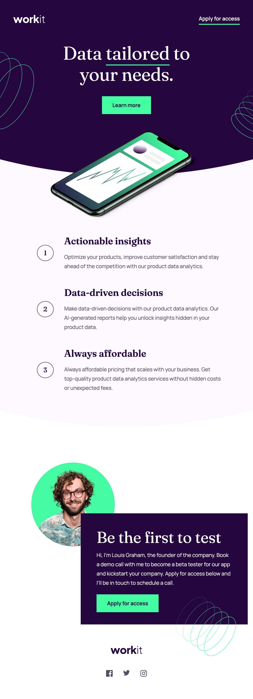

# Frontend Mentor - Workit landing page solution

This is a solution to the [Workit landing page challenge on Frontend Mentor](https://www.frontendmentor.io/challenges/workit-landing-page-2fYnyle5lu). Frontend Mentor challenges help you improve your coding skills by building realistic projects.

## Table of contents

- [Overview](#overview)
  - [The challenge](#the-challenge)
  - [Screenshot](#screenshot)
  - [Links](#links)
- [My process](#my-process)
  - [Built with](#built-with)
  - [What I learned](#what-i-learned)
  - [Continued development](#continued-development)
  - [Useful resources](#useful-resources)
- [Author](#author)
- [Acknowledgments](#acknowledgments)

## Overview

### The challenge

Users should be able to:

- View the optimal layout for the interface depending on their device's screen size
- See hover and focus states for all interactive elements on the page

### Screenshot

### Links

- Solution URL: [Add solution URL here](https://github.com/cwwittor/workit-landing-page)
- Live Site URL: [Add live site URL here](https://0925030a.workit-landing-page.pages.dev/)

## My process

### Built with

- Semantic HTML5 markup
- CSS custom properties
- Flexbox
- CSS Grid
- Mobile-first workflow

### What I learned

From this project I've learned a few different things in regards to this process.

- Use of Border Radius to build a custom arch.
- Use case of auto along with a set width.
- I had learned that I should put more thought on if something can be a grid. Had not thought about that for the founder section but after some discussion with a coworker it would definitely be possible and wouldve probably been better than the amount of margin/padding im using for it now.
- Using relative positioning for an image with a div.

Use this section to recap over some of your major learnings while working through this project. Writing these out and providing code samples of areas you want to highlight is a great way to reinforce your own knowledge.

The things I am most proud about this project are:

- I think at least starting out I had a better go with variables and variable names in the stylesheet.
- Think the areas that used flexbox came a little faster to me this time and had an easier time identifying what I wanted with flexbox and block.
- Swapped off px in favor of rem

### Continued development

Things I want to improve upon:

- I need to use more semantic html
- I still got a little lazy with variables towards the end for cms
- Can improve upon thinking about grid solutions to problems
- I still need to get better about using Margins and Padding. Think there were probably places where I couldve used different implementation.
- I am unsure if we are supposed to be just creating these viewports, but if we are supposed to have perfect responsiveness in between the specified viewports I need to work around getting absolute images to be more responsive

## Author

- Frontend Mentor - [@cwwittor](https://www.frontendmentor.io/profile/cwwittor)

## Acknowledgments

My coworker Andrew gave me some tips and advice.
